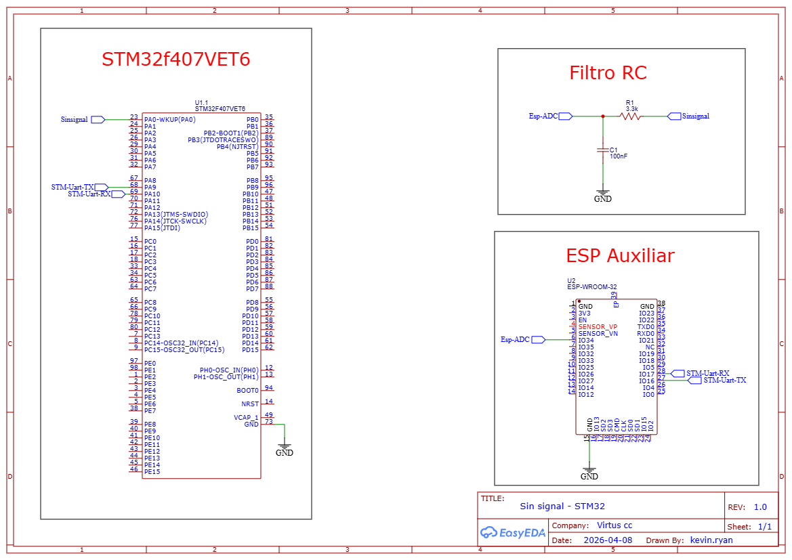

# Gerador SPWM Bare-Metal com STM32 (DDS)

Este repositório contém o código-fonte em C para a geração de um sinal SPWM (Sine Pulse Width Modulation) de alta precisão utilizando um microcontrolador da família STM32. O projeto foi desenvolvido como parte da disciplina de Sistemas Embarcados.

## Descrição da Solução

O firmware implementa uma arquitetura orientada a eventos baseada na técnica de Síntese Digital Direta (DDS). O laço principal do programa (`while(1)`) permanece intencionalmente vazio, delegando todo o processamento crítico para interrupções de hardware, garantindo a execução em tempo real sem travamentos.

1. **Look-Up Table (LUT):** Na inicialização, o sistema calcula uma tabela de seno com 4096 amostras (12 bits), armazenada na memória RAM. Essa alta resolução minimiza o ruído de quantização e reduz a Distorção Harmônica Total (THD) do sinal gerado.
2. **Motor de Tempo Real (Timer):** Um timer de hardware configurado para estourar a 20 kHz aciona uma interrupção que atualiza o duty cycle do PWM. O ponteiro de leitura da LUT avança de acordo com o incremento de um Acumulador de Fase de 32 bits.
3. **Controle Dinâmico (UART):** A recepção de dados atua via interrupção serial. Ao receber um comando externo, o sistema converte a string ASCII para inteiro e recalcula apenas o "passo" do acumulador de fase. Isso altera a frequência da onda instantaneamente, sem prejudicar o chaveamento do PWM.

## Equações Pertinentes

**1. Acumulador de Fase (DDS)**
O passo incrementado a cada interrupção determina a frequência final da onda gerada:
$$Passo = \frac{f_{desejada} \times 2^{32}}{f_{amostragem}}$$
*(Onde $f_{amostragem}$ é a frequência de interrupção do Timer, fixada em 20000 Hz).*

**2. Frequência de Corte do Filtro RC**
Para recuperar a senoide analógica a partir do sinal PWM digital, exige-se a conexão de um filtro passa-baixa no pino de saída. Utilizando a configuração recomendada de $R = 3.3k\Omega$ e $C = 100nF$:
$$f_c = \frac{1}{2\pi R C} \approx 482 \text{ Hz}$$

## Diagrama do Circuito

O diagrama a seguir ilustra a conexão necessária entre o pino de saída do microcontrolador e a topologia do filtro passivo para extração do sinal.

## Protocolo de Comunicação e Interface

Para que um sistema externo (computador ou outro microcontrolador) consiga alterar a frequência gerada, deve-se conectar à porta serial respeitando os parâmetros abaixo.

### Pinos Utilizados
* **Saída PWM:** PA0 (Timer 2, Canal 1)
* **Recepção UART (RX):** PA10 (USART1)

### Parâmetros Seriais
* **Baud Rate:** 115200 bps
* **Data bits:** 8
* **Parity:** None
* **Stop bits:** 1
* **Payload:** O sistema aguarda exatamente 3 caracteres ASCII numéricos representando a frequência alvo em Hertz. Exemplo: Para configurar uma saída de 60 Hz, o dispositivo externo deve enviar a string `060`. A faixa de operação recomendada é entre 005 Hz e 120 Hz.

